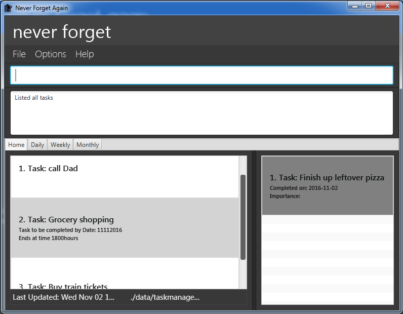

# Never Forget Again

 

* This is a desktop To-do List application. It has a GUI but most of the user interactions happen using
  a CLI (Command Line Interface).
*

#### Site Map
* [User Guide](docs/UserGuide.md)
* [Developer Guide](docs/DeveloperGuide.md)
* [About Us](docs/AboutUs.md)

#### Acknowledgements

* The original source of this code is the sample project created by [SE-EDU](https://github.com/se-edu/) initiative.
* This application was developed under professor Damith C. Rajapakse of the NUS teaching team.
* Special thanks to our tutor, Joel Tan, for guiding us throughout the development process.

#### Licence : [MIT](LICENSE)
