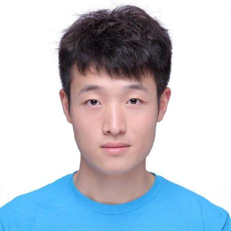
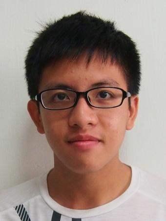

# About Us

We are a team of students taking the module CS2103 based in the [School of Computing, National University of Singapore](http://www.comp.nus.edu.sg).

## Project Team

#### [MIHNEA ARION](https://github.com/Sevreus)
 
**Role**: Developer  
* Components in charge of: [Storage](https://github.com/CS2103AUG2016-T17-C1/main/blob/master/docs/DeveloperGuide.md#storage-component)
* Also in charge of: [Testing](https://github.com/CS2103AUG2016-T17-C1/main/blob/master/docs/DeveloperGuide.md#testing), [Git](https://github.com/CS2103AUG2016-T17-C1), [Documentation](https://github.com/CS2103AUG2016-T17-C1/main/tree/master/docs)
* Code written: [[functional code](https://github.com/CS2103AUG2016-T17-C1/main/tree/master/collated/main/A0152952A.md)][[test code](https://github.com/CS2103AUG2016-T17-C1/main/tree/master/collated/test/A0152952A.md)][[docs](https://github.com/CS2103AUG2016-T17-C1/main/tree/master/collated/docs/A0152952A.md)]
* Contributions:
 * Initial set up of the organization on Git
 * Implemented shorthand commands
 * Contributed to [UI](https://github.com/CS2103AUG2016-T17-C1/main/blob/master/docs/DeveloperGuide.md#ui-component) and a few bug fixes

-----

#### [SHEN JIAHUI](http://github.com/JIAHUIs)
 
**Role**: Developer  
* Components in charge of: [GUI](https://github.com/CS2103AUG2016-T17-C1/main/blob/master/docs/DeveloperGuide.md#ui-component)
* Code written: [[functional code](https://github.com/CS2103AUG2016-T17-C1/main/tree/master/collated/main/A0127720M.md)][[test code](https://github.com/CS2103AUG2016-T17-C1/main/tree/master/collated/test/A0127720M.md)][[docs](https://github.com/CS2103AUG2016-T17-C1/main/tree/master/collated/docs/A0127720M.md)]
* Contributions:
 * Implementation of [mark/complete feature](https://github.com/CS2103AUG2016-T17-C1/main/tree/master/docs/UserGuide.md#marking-an-entry--mark),delete marked task,display specific command usage
 * Contributed to testing

-----

#### [SIN YU FAN](http://github.com/howitzerg)
 
**Role**: Team Leader  
* Components in charge of: [Logic](https://github.com/CS2103AUG2016-T17-C1/main/blob/master/docs/DeveloperGuide.md#logic-component)
* Code written: [[functional code](https://github.com/CS2103AUG2016-T17-C1/main/tree/master/collated/main/A0139284X.md)][[test code](https://github.com/CS2103AUG2016-T17-C1/main/tree/master/collated/test/A0139284X.md)][[docs(https://github.com/CS2103AUG2016-T17-C1/main/tree/master/collated/docs/A0139284X.md)]
* Contributions:
 * Major refactoring of address book to task manager application
 * Implementation of major features: [delete task](https://github.com/CS2103AUG2016-T17-C1/main/tree/master/docs/UserGuide.md#deleting-a-task--delete), [find task](https://github.com/CS2103AUG2016-T17-C1/main/tree/master/docs/UserGuide.md#finding-all-tasks-containing-any-keyword-in-their-name-find)
 * Setup Travis and Coveralls

-----

#### [TAY MING LIANG](http://github.com/mlteh)
 
**Role**: Developer  
* Components in charge of: [Model](https://github.com/CS2103AUG2016-T17-C1/main/blob/master/docs/DeveloperGuide.md#model-component)
* Code written: [[functional code](https://github.com/CS2103AUG2016-T17-C1/main/tree/master/collated/main/A0142360U.md)][[test code](https://github.com/CS2103AUG2016-T17-C1/main/tree/master/collated/test/A0142360U.md)][[docs](https://github.com/CS2103AUG2016-T17-C1/main/tree/master/collated/docs/A0142360U.md)]
* Contributions:
 * Initial refactoring of address book to task manager application
 * Initial base documentation
 * Creation of Sample data and script,
 * Implementation of major features: UI: Task Card,  [add task](https://github.com/CS2103AUG2016-T17-C1/main/tree/master/docs/UserGuide.md#adding-a-task-add), [undo](https://github.com/CS2103AUG2016-T17-C1/main/tree/master/docs/UserGuide.md#undo--undo), [redo task](https://github.com/CS2103AUG2016-T17-C1/main/blob/master/docs/UserGuide.md#redo--redo), [edit task](https://github.com/CS2103AUG2016-T17-C1/main/tree/master/docs/UserGuide.md#editing-a-task-edit), [change directory](https://github.com/CS2103AUG2016-T17-C1/main/blob/master/docs/UserGuide.md#change-tasks-storage-directory--cd), creation of event tasks

-----

#### [Joel Tan](https://github.com/JoelT-92)
 
**Role**: Tutor

-----

#### [Tyson Quek](https://github.com/pixelducky)
 
**Role**: Tutor

-----
