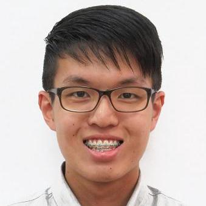

# About Us

We are a team of students taking a module CS2103 based in the [School of Computing, National University of Singapore](http://www.comp.nus.edu.sg).

## Project Team

#### [MIHNEA ARION]()  
 
**Role**: Developer

-----

#### [SHEN JIAHUI](http://github.com/JIAHUIs)
 
Role: Developer  
Responsibilities: -

-----

#### [SIN YU FAN](http://github.com/howitzerg)
 
Role: Developer  
Responsibilities: -

-----

#### [TAY MING LIANG](http://github.com/mlteh)
 
Role: Developer  
Responsibilities:-

#### [JOEL TAN](http://github.com/Sevreus)
 
Role: Tutor

-----

# Contributors

We welcome contributions. See [Contact Us](ContactUs.md) page for more info.

* [Akshay Narayan](https://github.com/se-edu/addressbook-level4/pulls?q=is%3Apr+author%3Aokkhoy)
* [Sam Yong](https://github.com/se-edu/addressbook-level4/pulls?q=is%3Apr+author%3Amauris)