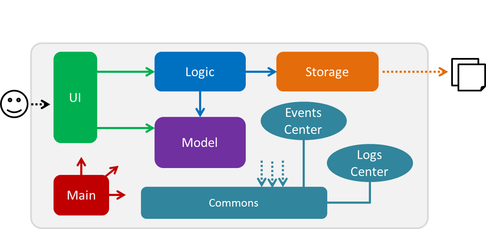
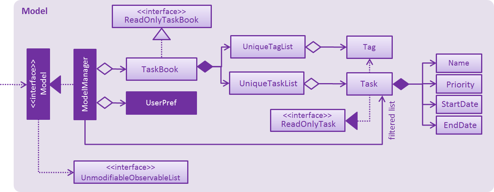
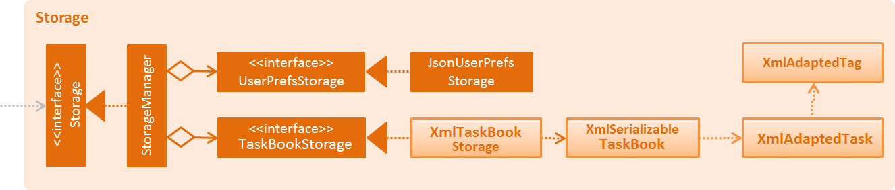

# Developer Guide 

* [Setting Up](#setting-up)
* [Design](#design)
* [Implementation](#implementation)
* [Testing](#testing)
* [Dev Ops](#dev-ops)
* [Appendix A: User Stories](#appendix-a--user-stories)
* [Appendix B: Use Cases](#appendix-b--use-cases)
* [Appendix C: Non Functional Requirements](#appendix-c--non-functional-requirements)
* [Appendix D: Glossary](#appendix-d--glossary)
* [Appendix E : Product Survey](#appendix-e-product-survey)

## Setting up

#### Prerequisites

1. **JDK `1.8.0_60`**  or later 

    > Having any Java 8 version is not enough.  
    This app will not work with earlier versions of Java 8.
    
2. **Eclipse** IDE
3. **e(fx)clipse** plugin for Eclipse (Do the steps 2 onwards given in
   [this page](http://www.eclipse.org/efxclipse/install.html#for-the-ambitious))
4. **Buildship Gradle Integration** plugin from the Eclipse Marketplace

#### Importing the project into Eclipse

0. Fork this repo, and clone the fork to your computer
1. Open Eclipse (Note: Ensure you have installed the **e(fx)clipse** and **buildship** plugins as given 
   in the prerequisites above)
2. Click `File` > `Import`
3. Click `Gradle` > `Gradle Project` > `Next` > `Next`
4. Click `Browse`, then locate the project's directory
5. Click `Finish`

  > * If you are asked whether to 'keep' or 'overwrite' config files, choose to 'keep'.
  > * Depending on your connection speed and server load, it can even take up to 30 minutes for the set up to finish
      (This is because Gradle downloads library files from servers during the project set up process)
  > * If Eclipse auto-changed any settings files during the import process, you can discard those changes.

## Design

### Architecture

 
The **_Architecture Diagram_** given above explains the high-level design of the App.
Given below is a quick overview of each component.

`Main` has only one class called [`MainApp`](../src/main/java/seedu/address/MainApp.java). It is responsible for,
* At app launch: Initializes the components in the correct sequence, and connect them up with each other.
* At shut down: Shuts down the components and invoke cleanup method where necessary.

[**`Commons`**](#common-classes) represents a collection of classes used by multiple other components.
Two of those classes play important roles at the architecture level.
* `EventsCentre` : This class (written using [Google's Event Bus library](https://github.com/google/guava/wiki/EventBusExplained))
  is used by components to communicate with other components using events (i.e. a form of _Event Driven_ design)
* `LogsCenter` : Used by many classes to write log messages to the App's log file.

The rest of the App consists four components.
* [**`UI`**](#ui-component) : The UI of tha App.
* [**`Logic`**](#logic-component) : The command executor.
* [**`Model`**](#model-component) : Holds the data of the App in-memory.
* [**`Storage`**](#storage-component) : Reads data from, and writes data to, the hard disk.

Each of the four components
* Defines its _API_ in an `interface` with the same name as the Component.
* Exposes its functionality using a `{Component Name}Manager` class.

For example, the `Logic` component (see the class diagram given below) defines it's API in the `Logic.java`
interface and exposes its functionality using the `LogicManager.java` class. 
 

The _Sequence Diagram_ below shows how the components interact for the scenario where the user issues the
command `delete 3`.

>Note how the `Model` simply raises a `AddressBookChangedEvent` when the Address Book data are changed,
 instead of asking the `Storage` to save the updates to the hard disk.

The diagram below shows how the `EventsCenter` reacts to that event, which eventually results in the updates
being saved to the hard disk and the status bar of the UI being updated to reflect the 'Last Updated' time.  

> Note how the event is propagated through the `EventsCenter` to the `Storage` and `UI` without `Model` having
  to be coupled to either of them. This is an example of how this Event Driven approach helps us reduce direct 
  coupling between components.

The sections below give more details of each component.

### UI component

 

**API** : [`Ui.java`](../src/main/java/seedu/address/ui/Ui.java)

The UI consists of a `MainWindow` that is made up of parts e.g.`CommandBox`, `ResultDisplay`, `PersonListPanel`,
`StatusBarFooter`, `BrowserPanel` etc. All these, including the `MainWindow`, inherit from the abstract `UiPart` class
and they can be loaded using the `UiPartLoader`.

The `UI` component uses JavaFx UI framework. The layout of these UI parts are defined in matching `.fxml` files
 that are in the `src/main/resources/view` folder. 
 For example, the layout of the [`MainWindow`](../src/main/java/seedu/address/ui/MainWindow.java) is specified in
 [`MainWindow.fxml`](../src/main/resources/view/MainWindow.fxml)

The `UI` component,
* Executes user commands using the `Logic` component.
* Binds itself to some data in the `Model` so that the UI can auto-update when data in the `Model` change.
* Responds to events raised from various parts of the App and updates the UI accordingly.

### Logic component

 

**API** : [`Logic.java`](../src/main/java/seedu/address/logic/Logic.java)

1. `Logic` uses the `Parser` class to parse the user command.
2. This results in a `Command` object which is executed by the `LogicManager`.
3. The command execution can affect the `Model` (e.g. adding a person) and/or raise events.
4. The result of the command execution is encapsulated as a `CommandResult` object which is passed back to the `Ui`.

Given below is the Sequence Diagram for interactions within the `Logic` component for the `execute("delete 1")`
 API call. 
 

### Model component

 

**API** : [`Model.java`](../src/main/java/seedu/address/model/Model.java)

The `Model`,
* stores a `UserPref` object that represents the user's preferences.
* stores the Address Book data.
* exposes a `UnmodifiableObservableList<ReadOnlyPerson>` that can be 'observed' e.g. the UI can be bound to this list
  so that the UI automatically updates when the data in the list change.
* does not depend on any of the other three components.

### Storage component

 

**API** : [`Storage.java`](../src/main/java/seedu/address/storage/Storage.java)

The `Storage` component,
* can save `UserPref` objects in json format and read it back.
* can save the Address Book data in xml format and read it back.

### Common classes

Classes used by multiple components are in the `seedu.addressbook.commons` package.

## Implementation

### Logging

We are using `java.util.logging` package for logging. The `LogsCenter` class is used to manage the logging levels
and logging destinations.

* The logging level can be controlled using the `logLevel` setting in the configuration file
  (See [Configuration](#configuration))
* The `Logger` for a class can be obtained using `LogsCenter.getLogger(Class)` which will log messages according to
  the specified logging level
* Currently log messages are output through: `Console` and to a `.log` file.

**Logging Levels**

* `SEVERE` : Critical problem detected which may possibly cause the termination of the application
* `WARNING` : Can continue, but with caution
* `INFO` : Information showing the noteworthy actions by the App
* `FINE` : Details that is not usually noteworthy but may be useful in debugging
  e.g. print the actual list instead of just its size

### Configuration

Certain properties of the application can be controlled (e.g App name, logging level) through the configuration file 
(default: `config.json`):

## Testing

Tests can be found in the `./src/test/java` folder.

**In Eclipse**:
> If you are not using a recent Eclipse version (i.e. _Neon_ or later), enable assertions in JUnit tests
  as described [here](http://stackoverflow.com/questions/2522897/eclipse-junit-ea-vm-option).

* To run all tests, right-click on the `src/test/java` folder and choose
  `Run as` > `JUnit Test`
* To run a subset of tests, you can right-click on a test package, test class, or a test and choose
  to run as a JUnit test.

**Using Gradle**:
* See [UsingGradle.md](UsingGradle.md) for how to run tests using Gradle.

We have two types of tests:

1. **GUI Tests** - These are _System Tests_ that test the entire App by simulating user actions on the GUI. 
   These are in the `guitests` package.
  
2. **Non-GUI Tests** - These are tests not involving the GUI. They include,
   1. _Unit tests_ targeting the lowest level methods/classes.  
      e.g. `seedu.address.commons.UrlUtilTest`
   2. _Integration tests_ that are checking the integration of multiple code units 
     (those code units are assumed to be working). 
      e.g. `seedu.address.storage.StorageManagerTest`
   3. Hybrids of unit and integration tests. These test are checking multiple code units as well as 
      how the are connected together. 
      e.g. `seedu.address.logic.LogicManagerTest`
  
**Headless GUI Testing** :
Thanks to the [TestFX](https://github.com/TestFX/TestFX) library we use,
 our GUI tests can be run in the _headless_ mode. 
 In the headless mode, GUI tests do not show up on the screen.
 That means the developer can do other things on the Computer while the tests are running. 
 See [UsingGradle.md](UsingGradle.md#running-tests) to learn how to run tests in headless mode.
  
## Dev Ops

### Build Automation

See [UsingGradle.md](UsingGradle.md) to learn how to use Gradle for build automation.

### Continuous Integration

We use [Travis CI](https://travis-ci.org/) to perform _Continuous Integration_ on our projects.
See [UsingTravis.md](UsingTravis.md) for more details.

### Making a Release

Here are the steps to create a new release.
 
 1. Generate a JAR file [using Gradle](UsingGradle.md#creating-the-jar-file).
 2. Tag the repo with the version number. e.g. `v0.1`
 2. [Crete a new release using GitHub](https://help.github.com/articles/creating-releases/) 
    and upload the JAR file your created.
   
### Managing Dependencies

A project often depends on third-party libraries. For example, Address Book depends on the
[Jackson library](http://wiki.fasterxml.com/JacksonHome) for XML parsing. Managing these _dependencies_
can be automated using Gradle. For example, Gradle can download the dependencies automatically, which
is better than these alternatives. 
a. Include those libraries in the repo (this bloats the repo size) 
b. Require developers to download those libraries manually (this creates extra work for developers) 

## Appendix A : User Stories

Priorities: High (must have) - `* * *`, Medium (nice to have)  - `* *`,  Low (unlikely to have) - `*`

Priority | As a ... | I want to ... | So that I can...
-------- | :-------- | :--------- | :-----------
`* * *` | new user | view more information about commands available | learn more about commands
`* * *` | user | add task | record tasks I need to do
`* * *` | user | have shortcuts | use the application more efficiently
`* * *` | user | set a deadline upon adding task | keep track of due dates
`* * *` | user | edit tasks | update tasks
`* * *` | user | delete tasks | remove irrelevant tasks
`* * *` | advanced user | customise shortcuts | choose more suitable key combinations
`* * *` | user | undo changes | reverse any mistakes I did
`* * *` | user | redo changes | reverse the undo command
`* * *` | user | delete tasks | remove irrelevant tasks
`* * *` | user | mark completed tasks | indicate task as completed
`* * *` | user | view upcoming tasks by day/week/month | decide what to do
`* *` | user | prioritise task (urgent/less urgent or important/trivial) | categorise tasks by priority
`* *` | user | add tags to task | label tasks
`* *` | user | list tasks with specific label | view tasks from a certain category
`* *` | user | mark task as recurrent | be able to identify interval-based tasks
`* *` | user | view recurrent tasks | view tasks that take place on an interval basis
`* *` | user | list 'general' tasks (without time allocated) | keep track of such tasks
`* *` | user | list tasks without deadline allocated | keep track of such tasks
`* *` | user | set reminders for deadlines/time boxed tasks | do tasks on time
`* *` | user | allocate time to do task upon adding | time box tasks
`*` | user | add venues to task | know where a task is supposed to take place
`*` | user | view all available free time | decide which time slot to use to relax or allocate a task
`*` | user | time myself when doing tasks | keep track of time taken for a task

## Appendix B : Use Cases

(For all use cases below, the **System** is the `To-Do-List` and the **Actor** is the `user`, unless specified otherwise)

### Use Case: Add task

**MSS**

1. User enters task to be added
2. To-Do-List adds task
3. To-Do-List shows task is added
Use case ends

**Extensions**

1a. Given input is invalid 
1a1. To-Do-List shows an error message and an input example 
Use case resumes at step 1 

1b. Task has been added before 
1b1. To-Do-List reports that task has been added before 
Use case ends 

Note: all subsequent add task use cases are subsets of add task use case above

### Use Case: Add task with deadline

**MSS**

1. User enters task to be added
2. To-Do-List adds task
3. To-Do-List shows task is added
Use case ends

**Extensions**

1a. Given date input is invalid 
1a1. To-Do-List shows an error message and an input example 
1a2. User enters deadline 
Use case repeats 1a until user enters a valid deadline or chooses to add task without deadline 
Use case resumes at step 2 


#### Use Case: Add task with time allocated

**MSS**

1. User enters task to be added
2. To-Do-List adds task
3. To-Do-List shows task is added
Use case ends

**Extensions**

1a. Proposed allocation time is not available 
1a1. To-Do-List reports that proposed time is not available 
1a2. User enters another time 
Use case repeats 1a until user proposes a suitable time or chooses to add task without allocating time 
Use case resumes at step 2 

1b. Given time input is invalid 
1a1. To-Do-List shows an error message and an input example 
1a2. User enters another time 
Use case repeats 1a until user proposes a suitable time or chooses to add task without allocating time 
Use case resumes at step 2 

### Use Case: Add task with priority tagging

**MSS**

1. User enters task to be added
2. To-Do-List adds task
3. To-Do-List shows task is added
Use case ends

**Extensions**

1a. Priority tag input is invalid 
1a1. To-Do-List reports that priority tag input is invalid 
1a2. User enters priority 
Use case repeats 1a until user proposes a valid tag or chooses to add task without setting priority 
Use case resumes at step 2 

 
 
### Use Case: Add task with tagging

**MSS**

1. User enters task to be added
2. To-Do-List adds task
3. To-Do-List shows task is added
Use case ends

### Use Case: Edit task

**MSS**

1. User enters task to be added
2. To-Do-List adds task
3. To-Do-List shows task is added
Use case ends

**Extensions**

1a. Priority tag input is invalid 
1a1. To-Do-List reports that priority tag input is invalid 
1a2. User enters priority 
Use case repeats 1a until user proposes a valid tag or chooses to add task without setting priority 
Use case resumes at step 2 

## Appendix C : Non Functional Requirements

1. Should work on any [mainstream OS](#mainstream-os).
2. Should be able to hold and display at least 30 tasks per day for each day over a period of one month.
3. Shortcuts should be intuitive and easy to apply by the user i.e. "Home" button on keyboard should transfer the user back to the main window (the "Home") of the app.
4. Should favor DOS style commands over Unix-style commands.
5. Should mainly focus on keyboard input rather than clicks (keyboard favoured over "click-to-add" method).

## Appendix D : Glossary

##### Mainstream OS

> Windows, Linux, Unix, OS-X

##### Popular app

> Application that frequently makes it into "Top X" lists published by tech sites for those certain requirements

##### Competing product

> A product which satisfies similar user requirements

## Appendix E : Product Survey

Even just a short search on the web brings up very many results which are popular apps for countless users.

#### Widely used competing products

##### Wunderlist
> This application is cloud-based, and its basic version is free. Extra features, however, are available in a paid version. Interestingly, Wunderlist is not able to save entries as PDF or HTML files. The number of subtasks is also limited in the basic version. Wunderlists's popularity stands as a testimony to its many users. Overall, this is quite a good application for Jim, as it includes keyboard shortcuts for accessing the various commands.

##### Evernote
> Evernote is a flexible application with a basic version for free and extra features implemented to various degrees through payed versions. There is also an upload limit based on this. Evernote has its own set of shortcuts, which thus makes it a good choice for a user such as Jim.

##### Notes (iOS)
> The main advantage of Notes is that it is free; however, it is OS-dependent and works in a simple, albeit straightforward manner. In the case of Jim, he might or might not use iOS, so a more flexible app would be better.

##### Google Calendar/Tasks
> One of the main advantages of this application is its availability for free; also, it presents itself to the user in a clear, straightforward manner (for example: tasks are set on certain dates, at certain times, can be recurring). Keyboard shorcuts can be activated when the user clicks and selects a certain option in the settings. Once the shortcuts have been activated, Jim might be quite interested in using this application.

##### Google keep
> Google keep is a free note-taking application that is mobile-based; however, it is also available via Chrome as a packaged app. It also implements shortcuts. It can be an attractive option for someone like Jim, as long as he is using the Chrome web browser.

##### MS Onenote
> A free application that is quite flexible. An interesting feature of this application is that the user may click anywhere in the window in order to write; however, this is not particularly helpful for Jim, who prefers typing and keyboard command-driven programs, but it also implements some shortcuts; overall, it is a fair choice for a user like Jim.

##### List of other popular competing products

> `Remember the Milk`, `Springpad`, `Colornote`, `Simplenote`, `Notability`, `Penultimate`, `Todoist`, `Clear`, `Swipes`, `Pocket Lists`, `Carrot`, `Everyday`, `Paperless`.

