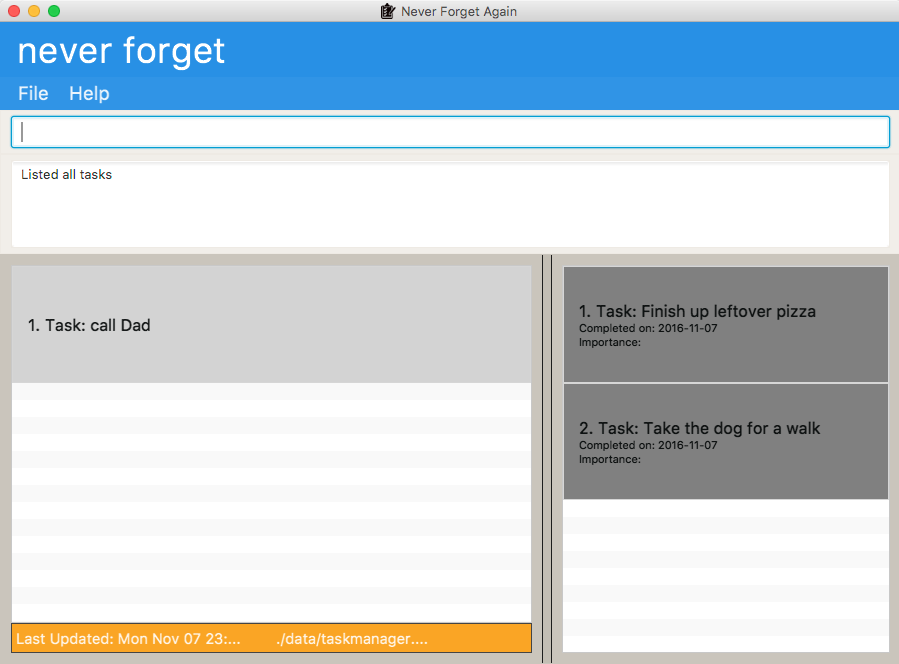
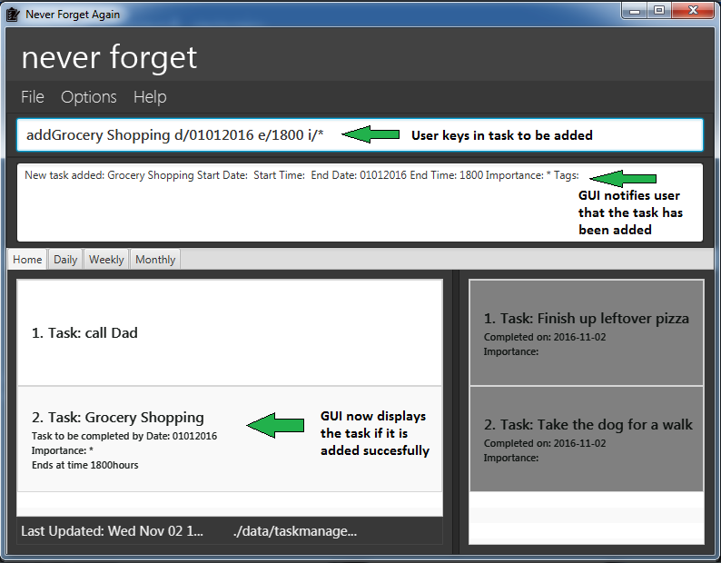

# User Guide

* [Quick Start](#quick-start)
* [Features](#features)
* [FAQ](#faq)
* [Command Summary](#command-summary)

## Quick Start

0. Ensure you have Java version `1.8.0_60` or later installed in your Computer. 
   > Having any Java 8 version is not enough.  
   This app will not work with earlier versions of Java 8.

1. Download the latest `neverforgetagain.jar` from the [releases](../../../releases) tab.
2. Copy the file to the folder you want to use as the home folder for your to-do list.
3. Double-click the file to start the app. The GUI should appear in a few seconds.
   

## Features

> **Command Format**
> * Words in `UPPER_CASE` are the parameters.
> * Items in `SQUARE_BRACKETS` are optional.
> * Items with `...` after them can have multiple instances.
> * The order of parameters is fixed.

> 

4. Type an action in the command box and press <kbd>Enter</kbd> to execute it.  
   e.g. typing **`help`** and pressing <kbd>Enter</kbd> or clicking on the help button will open the help window.
5. Some example commands you can try:
   * **`list`** : lists all tasks
   * **`add`**` Buy a cup of coffee` : Add a task to buy a cup of coffee without setting any deadlines for it to the to-do list.

   * **`add`**` Grocery Shopping d/01012016 e/1800 i/* t/NTUC` :
     adds a task `Grocery Shopping` with specified time, importance and tag to Never Forget.

   * **`delete`**` 3` : deletes the 3rd task shown in the current list
   * **`exit`** : exits the app

6. Refer to the [Features](#features) section below for details of each command. 

<!-- @@author A0127720M -->
#### Viewing help : `help`
View help page for commands, including hotkeys. Or check how to use a specific command by typing the particular command word after 'help'. 

List of available [command word] for help: 
- add 
- delete
- deleteM
- bare
- find
- edit
- list 
- select
- mark
- undo
- redo
- cd
- clear
- clearM
- exit

Format: 1)`help` 2)`help [command word]` 
Shorthand: `h` 
<!-- @@author  -->

#### Finding all tasks containing any keyword in their name: `find`
Finds tasks whose names contain any of the given keywords. 
Format: `find KEYWORD [MORE_KEYWORDS]` 
Shorthand: `f` 

> * The search is not case sensitive. e.g `buy` will match `Buy`
> * The order of the keywords does not matter. e.g. `Buy Bread` will match `Bread Buy`
> * Only the name is searched.
> * Non full words will still be matched e.g. `brea` WILL match `bread`
> * tasks matching at least one keyword will be returned (i.e. `OR` search).
    e.g. `buy` will match `buy bread`

Examples:
* `find meeting` 
  Returns `meetings` and `Meetings` but not `meet`
* `find coffee complete homework` 
  Returns any tasks containing names `coffee`, `complete`, or `homework`

#### Adding a task: `add`
Adds a task to Never Forget 
Format: `add TASK_NAME d/SCHEDULED_DATE e/SCHEDULED_END_TIME i/IMPORTANCE [t/TAG]...` 
Shorthand: `a` 

> Tasks can have any number of tags (including 0)

Examples:
* `add Grocery Shopping d/01012016 e/1800 i/*`
* `add Dinner with JC Friends d/07102016 e/1930 i/** t/Budget t/Meal t/Buddies`

#### Baring a task: `bare`
Bares an existing task of its date(s) and time(s) 
Format: `bare INDEX` 
Shorthand: `b` 

> Tasks retain all the other details

Example:
* `bare 3`

#### Editing a task: `edit`
Edits a task currently held in Never Forget 
Format: `edit INDEX d/SCHEDULED_DATE e/SCHEDULED_END_TIME i/IMPORTANCE [t/TAG]...` 
Shorthand: `e` 

> Tasks can have any number of tags (including 0). 
> Edit will remove an already existing tag if it specified again:`edit INDEX t/EXISTING_TAG`  
> All tags of a specific entry can be cleared with the command format: `edit INDEX t/NONE`

Examples:
* `edit 2 d/01012016 e/1700 i/***`
* `edit 3 d/07102016 e/2030 i/* t/Budget t/Meal t/Friends`

#### Deleting a task : `delete`
Deletes the specified task from the to-do list. Can be reversed with `undo` command. 
Format: `delete INDEX` 
Shorthand: `d` 

> Deletes the task at the specified `INDEX`.
  The index refers to the index number shown in the most recent listing. 
  The index **must be a positive integer** 1, 2, 3, ...

#### Listing all of today's tasks : `list`
Shows a list of all tasks today in Never Forget. 
Format: `list` 
Shorthand: `l` 

#### Selecting tasks : `select`
Selects the specified task (by index) in the to-do list.
Format: `select INDEX` 
Shorthand: `s`  

Examples:
* `list` 
  `select 2` 
  Selects the 2nd task in the to-do list.
* `find Buy bread`  
  `select 1` 
  Selects the 1st task in the results of the `find` command. 
  

#### Clearing all entries : `clear`
Clears all entries from the to-do list. The user is asked to confirm before proceeding. 
Format: `clear`

#### Exiting the program : `exit`
Exits the program. 
Format: `exit`

#### Marking an entry : `mark`
Marks an entry as completed.  
Format: `mark INDEX` 
Shorthand: `m` 

#### Undo : `undo`
Undo previous command.  
The Undo command can be executed as many times as needed to the point of application launch.
Format: `undo` 
Shorthand: `u` 

#### Redo : `redo`
Reverse undo command.  
The Redo command can only be executed immediately after one or more Undo commands.
If any command other than Undo makes changes to the task list, the Redo command is no longer available until Undo is executed again.
Format: `redo` 
Shorthand: `r` 

#### Change tasks storage directory : `cd`
Changes the storage location of the Task list for Never Forget  
> *Users are given an option whether they would like to import their tasks to the new storage location.   
> *If they would not like to do so, the task manager will start from an empty task list in the new storage location.  
> *The default location is at the 'data/' folder of where the Never Forget.jar is located. 

Note: Storage location has to be declared relative to the position of Never Forget.jar. If users would like to navigate to a higher directory,
	  they can use '../' 
Note: This action will cause Never Forget to terminate. Users will have to re-launch their application again. 
Format: `cd {STORAGE LOCATION}/` 
		 `cd data/`

#### Saving the data
Never Forget data are saved in the hard disk automatically after any command that changes the data. 
There is no need to save manually.

#### Sorting the displayed task list : `select any one of: Home(which displays everything), Daily, Weekly or Monthly`
Displays the task listing for that desired time frame. 

> Displays the task listing for that desired time frame.
  Tasks with no deadlines are only displayed in the Home listing where all tasks are displayed. 
  User must select any one of the tabs, Home, Daily, Weekly or Monthly.

## FAQ

**Q**: How do I transfer my data to another Computer? 
**A1**: Install the app in the other computer and overwrite the empty data file it creates with
       the file that contains the data of your previous to-do list folder.  
**A2**: An alternate way would be to use the inbuilt storage transfer command `cd` and File Hosting services such as dropbox. 
		Using the `cd` command, change the working directory of Never Forget & also select the option to transfer the tasks to a folder on dropbox. 
		From the other computer,use `cd` to change **_only_** the working directory of Never Forget to the same folder on dropbox. 
		Lastly, if needed, change the working directory of Never Forget & also select the option to transfer the tasks to a _**local**_ folder.

## Command Summary

Command | Format
-------- | :--------
Add | `add TASK d/DDMMYYYY t/HHMM i/*[*]... [t/TAG]...`
Bare | `bare INDEX`
Change Directory | `cd {STORAGE LOCATION}/`
Clear | `clear`
ClearM | `ClearM`
Delete | `delete INDEX`
DeleteM | `deleteM INDEX`
Edit | `edit TASK d/DDMMYYYY t/HHMM i/*[*]... [t/TAG]...`
Find | `find KEYWORD [MORE_KEYWORDS]`
Help | `help`
List | `list`
Mark | `mark INDEX`
Select | `select INDEX`
Redo | `redo`
Undo | `undo`
Exit | `exit`
