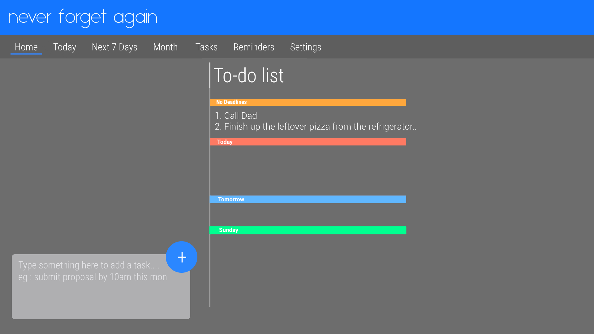

# User Guide

* [Quick Start](#quick-start)
* [Features](#features)
* [FAQ](#faq)
* [Command Summary](#command-summary)

## Quick Start

0. Ensure you have Java version `1.8.0_60` or later installed in your Computer. 
   > Having any Java 8 version is not enough.  
   This app will not work with earlier versions of Java 8.

1. Download the latest `neverforgetagain.jar` from the [releases](../../../releases) tab.
2. Copy the file to the folder you want to use as the home folder for your to-do list.
3. Double-click the file to start the app. The GUI should appear in a few seconds.
   > 

4. Type a action in the command box and press <kbd>Enter</kbd> or click on the "+" icon to execute it.  
   e.g. typing **`help`** and pressing <kbd>Enter</kbd> or clicking on the help button will open the help window.
5. Some example commands you can try:
   * **`list`** : lists all tasks
   * **`add`**` Buy a cup of coffee` : Add a task to buy a cup of coffee without setting any deadlines for it
     adds a contact named `John Doe` to the to-do list.
   * **`delete`**` 3` : deletes the 3rd task shown in the current list
   * **`exit`** : exits the app
6. Refer to the [Features](#features) section below for details of each command. 

## Features

> **Command Format**
> * Words in `UPPER_CASE` are the parameters.
> * Items in `SQUARE_BRACKETS` are optional.
> * Items with `...` after them can have multiple instances.
> * The order of parameters is fixed.

#### Viewing help : `help`
Format: `help`

> Help is also shown if you enter an incorrect command e.g. `abcd`

#### Adding a task: `add`
Adds a task to the to-do-list without setting deadlines for it 
Format: `add complete cs2103 homework`

> tasks can have any number of tags (including 0)

Examples:
* `add complete cs2103 homework deadline/171016-2100`   add a task to complete a cs2103 homework and the deadline for it is 17 Oct 2016 9pm
* `add meet up with yufan starttime/181016-1400 endtime/181016-1500 venue/royals bistro`  add a task to meet a guy named yufan that starts on 18 oct 2016, from 2pm to 3pm

#### Listing all tasks : `list`
Shows a list of all tasks in the to do list. 
Format: `list`

#### Finding all tasks containing any keyword in their name: `find`
Finds tasks whose names contain any of the given keywords. 
Format: `find KEYWORD [MORE_KEYWORDS]`

> * The search is case sensitive. e.g `hans` will not match `Hans`
> * The order of the keywords does not matter. e.g. `Hans Bo` will match `Bo Hans`
> * Only the name is searched.
> * Non full words will still be matched e.g. `Han` WILL match `Hans`
> * tasks matching at least one keyword will be returned (i.e. `OR` search).
    e.g. `Hans` will match `Hans Bo`

Examples:
* `find meeting` 
  Returns `meetings` and `Meetings` but not `meet`
* `find coffe complete homework` 
  Returns Any tasks containing names `coffe`, `complete`, or `homwork`

#### Deleting a task : `delete`
Deletes the specified task from the to-do list. Irreversible. 
Format: `delete INDEX`

> Deletes the task at the specified `INDEX`.
  The index refers to the index number shown in the most recent listing. 
  The index **must be a positive integer** 1, 2, 3, ...

#### Completing a task : `complete`
Strikes off the specified task from the to-do list. Reversible. 
Format: `complete INDEX`

> Deletes the task at the specified `INDEX`.
  The index refers to the index number shown in the most recent listing. 
  The index **must be a positive integer** 1, 2, 3, ...

Examples:
* `list` 
  `delete 2` 
  Deletes the 2nd task in the to-do list.
* `find Betsy` 
  `delete 1` 
  Deletes the 1st task in the results of the `find` command.

#### Select a task : `select`
Selects the task identified by the index number used in the last task listing. 
Format: `select INDEX`

> Selects the task and loads the Google search page the task at the specified `INDEX`.
  The index refers to the index number shown in the most recent listing. 
  The index **must be a positive integer** 1, 2, 3, ...

Examples:
* `list` 
  `select 2` 
  Selects the 2nd task in the to-do list.
* `find Betsy`  
  `select 1` 
  Selects the 1st task in the results of the `find` command.

#### Clearing all entries : `clear`
Clears all entries from the to-do list. 
Format: `clear`

#### Exiting the program : `exit`
Exits the program. 
Format: `exit`

#### Saving the data
to-do list data are saved in the hard disk automatically after any command that changes the data. 
There is no need to save manually.

#### Sorting the displayed task list : `click on either Home(which displays everything) Today, Next 7 Days or Month`
Displays the task listing for that desired time frame 

> Displays the task listing for that desired time frame
  Tasks with no deadlines are only displayed in the Home listing where all tasks are displayed 
  User must select any of the tabs, HOME, TODAY, Next 7 Days or Month

## FAQ

**Q**: How do I transfer my data to another Computer? 
**A**: Install the app in the other computer and overwrite the empty data file it creates with
       the file that contains the data of your previous to-do list folder.

## Command Summary

Command | Format
-------- | :--------
Add | `add task deadline/date-time venue/place [t/TAG]...`
Clear | `clear`
Delete | `delete INDEX`
Complete | `strikethrough the task at the INDEX`
Find | `find KEYWORD [MORE_KEYWORDS]`
List | `list`
Help | `help`
Select | `select INDEX`
